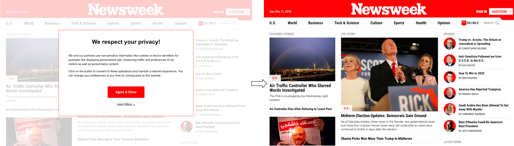

# Cookie Monster

  

Cookie Monster is a Chrome extension that blocks annoying 'accept cookies' popups.

Add Cookie Monster at the Chrome Web Store here.

Please file an issue if Cookie Monster fails to catch a popup or breaks a page.

Cookie Monster will not work on sites such as Time, the Washington Post or Yahoo News where the prompt is delivered on its own page.

[Icon](flaticon.com) by [Vitaly Gorbachev](https://www.flaticon.com/authors/vitaly-gorbachev)
